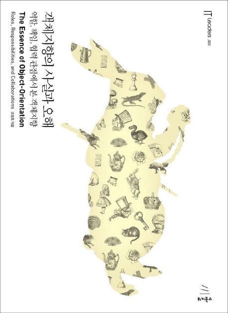

# 📖 객체지향의 사실과 오해(객사오)

  <strong>ComWith Team404 객체지향의 사실과 오해 스터디 👊</strong>

  

## 👨‍💻👨‍💻👩‍💻👨‍💻 스터디원

|  |  |  |  |
|:---:|:---:|:---:|:---:|
| 이성민([smiinii](https://github.com/smiinii)) | 박병욱([Rockernun](https://github.com/Rockernun)) | 이채원([C-ongshim](https://github.com/C-ongshim)) | 임재영([yim0327](https://github.com/yim0327)) |

## 📌 Study Rules

- **스터디 진행 기간** : 2025.08.15 ~ 2025.09.12
- **스터디 시간** : 매주 금요일 오후 1시

1. 매주 금요일까지 정해진 챕터를 읽는다.
2. 학습 내용을 정리해서 깃허브에 올린다.
3. 발표는 아래와 같이 해당되는 부분에 대해 진행한다.
    
    - *이해가 안 되거나 어려웠던 부분*
    - *추가적으로 자료 조사를 한 부분*
    - *중요하다고 생각하는 부분*
    - *다른 사람의 발표 자료 내용 중 궁금한 부분*
4. 각자 레포지토리 `Fork`를 한 후, 작업 후 각 챕터에 해당하는 `README.md`를 작성한다(필요 시 따로 코드 첨부해도 무방).  
5. **Commit & PR**은 스터디 시작 전까지 완료한다.    
